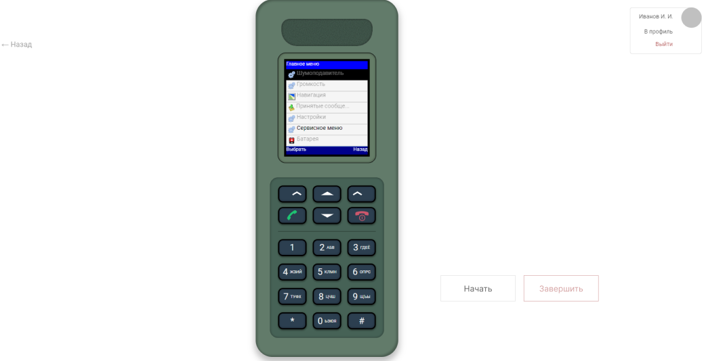

### Добавление функионала начала и завершения сессии пользователя (BE)

**Описание**

Пользователь при выборе конкретного УТК может начать его выполнение нажатием клавиши "Начать", после окончания пользователь нажимает "Завершить". 

После нажатия "Начать" кнопка становится недоступна, аналогично кнопка "Завершить" недоступна до начала выполнения УТК.



После нажатия кнопки "Завершить", пользователю отображается экран с результатом.


---

**Постановка задачи**

Добавить:
1. Ручки для запросов:

   - POST `/session/start?session_uid=...`
   - POST `/session/finish?session_uid=...`
2. Добавить соответствующие UseCase'ы в session_endpoint:

   - `StartSessionUseCase`
   - `FinishSessionUseCase`
   
3. Расширить доменный объект Session добавить:
   - Поле `status` - текущий статус сессии. Возможные значения:
     - `READY` - можно начать выполнение УТК
     - `STARTED` - пользователь начал выполнение УТК
   - Массив `attempts` - к-й будет хранить парами начало и конец сессии `[[12:34:12, 12:35:11], [12:37:56, None]]`
   - Поле `training` - название текущего УТК
4. Добавить интерфейсы:
```python
class TrainingResult:
    session_uid: str # идентификатор сессии
    mark: str # оценка
    attempt: int # номер попытки
    
    
class TrainingResultCalculatorStrategy:
    def calculate(self, session) -> TrainingResult:
        # implement
        pass

    
class TrainingResultCalculatorService:
   def __init__(self, strategies: List[TrainingResultCalculatorStrategy]):
      # implement
      pass
   
   def calculate(self, session) -> TrainingResult:
      # implement
      pass

```
5. Реализовать `DumbTrainingResultCalculatorStrategy` (логика метода `calculate` на усмотрение)
4. Реализовать созданные UseCase:
   - `StartSessionUseCase`: проверяет, можно ли перевести текущую сессию в статус `STARTED`. Переводит если это возможно, добавляет поле в массив `attempts`. Сохраняет сессию. В качестве результата возвращает **статус сессии**
   - `FinishSessionUseCase`: проверяет, можно ли перевести текущую сессию в статус `READY`. Переводит если это возможно, добавляет поле в массив `attempts`. Сохраняет сессию. Передает объект `session` в  `TrainingResultCalculatorService`. Возвращает **расчитанный калькулятором результат**