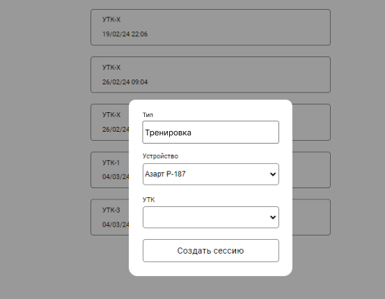
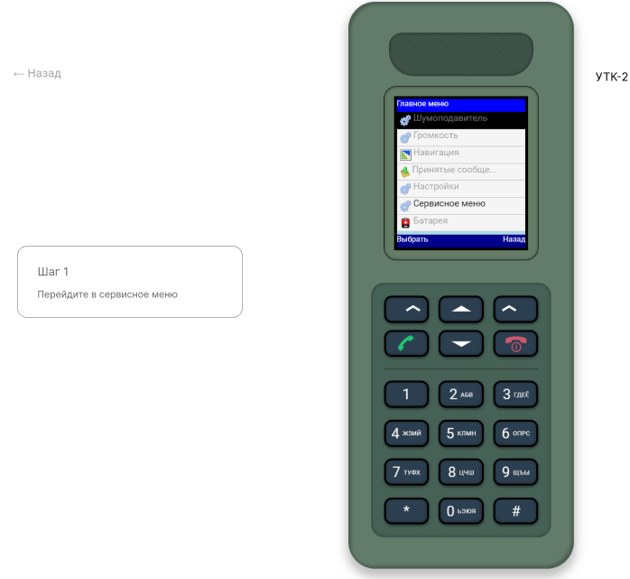

## MCS-40 Разработка функционала для режима тренировки

### Описание

При создании сессии пользователь может выбрать "Тип" = Тренировка

При этом в зависимости от выбранного УТК пользователю будут отрисовываться подсказки для прохождения тренировочного комплекса

### Постановка задачи

1. Расширить доменную модель объекта Session. 
   - Добавить поле `type`. Возможные значения:
       - `TRAINING` (тренировка)
       - `EXAM` (экзамен)
       - `FREE` (свободный)

2. Добавить api
   - GET `/session/training/validate?session_uid=...&screen_code=...`
3. Добавить реализацию api
   - Создать use-case `ValidateTrainingSessionUseCase`
   - Поместить вызов use-case в `session_endpoint`
---
4. Ознакомиться с классом в файле `common/message_source`
5. Ознакомиться с классом в файле `common/screen_navigator`
4. Ознакомиться с классом в файле `core/session/training/validator/training_validator`
4. Ознакомиться со структурой классов в файле `core/session/training/validator/step_validator`
   - Чтобы понять логику работы `BaseStepValidator`, ознакомиться с тестами `test_base_step_validator`
---
6. Реализовать `MessageSourceImpl`, ориентируясь на контракт в комментарии к методу `get_message()`
7. Реализовать `ScreenNavigatorImpl`, ориентируясь на контракт и на тесты `test_screen_navigator`. После реализации, все тесты должны проходить
8. Реализовать `UTK2Step1Validator`, `UTK2Step2Validator` в соответствии с методичкой и описанием шагов УТК-2. Ориентироваться на реализацию `ExampleStepValidator`
8. Написать тесты на `UTK2Step1Validator`, `UTK2Step2Validator`, ориентируясь на тесты `test_example_step_validator`

---
10. Создать реализацию `ValidateTrainingSessionUseCaseImpl`. Пока достаточно просто вызывать `TrainingValidator`.
11. Протестировать API через вызов `/session/training/validate?session_uid=...&screen_code=...`
